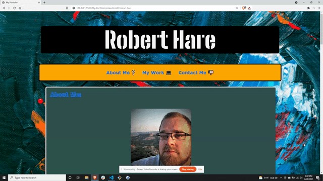
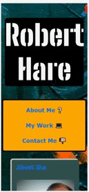

# Web-Dev-Portfolio 💻

My name is Robert Hare and this is my portfolio. This simple portfolio is a vehicle to showcase work that I am proud of and skills that I have learned.

# Tech-Used 🔧

Made with html and css

# Link-To-Deployed-Page 🎯
https://hare-ball.github.io/My-Portfolio/

# Screenshots 🎨

# License 📌

*This is application is covered under the MIT license. Follow the link for more information about the license.
*https://opensource.org/licenses/MITT

# Questions? 👋
* https://github.com/Hare-Ball
* Email me with additional questions at: email@email.com
